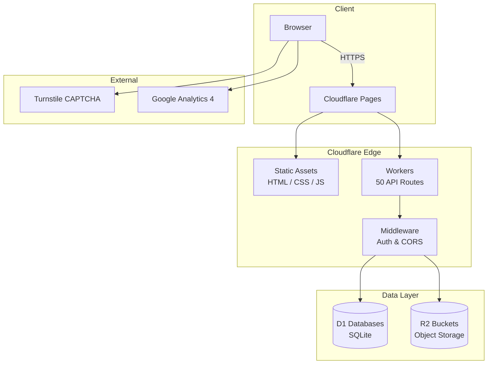
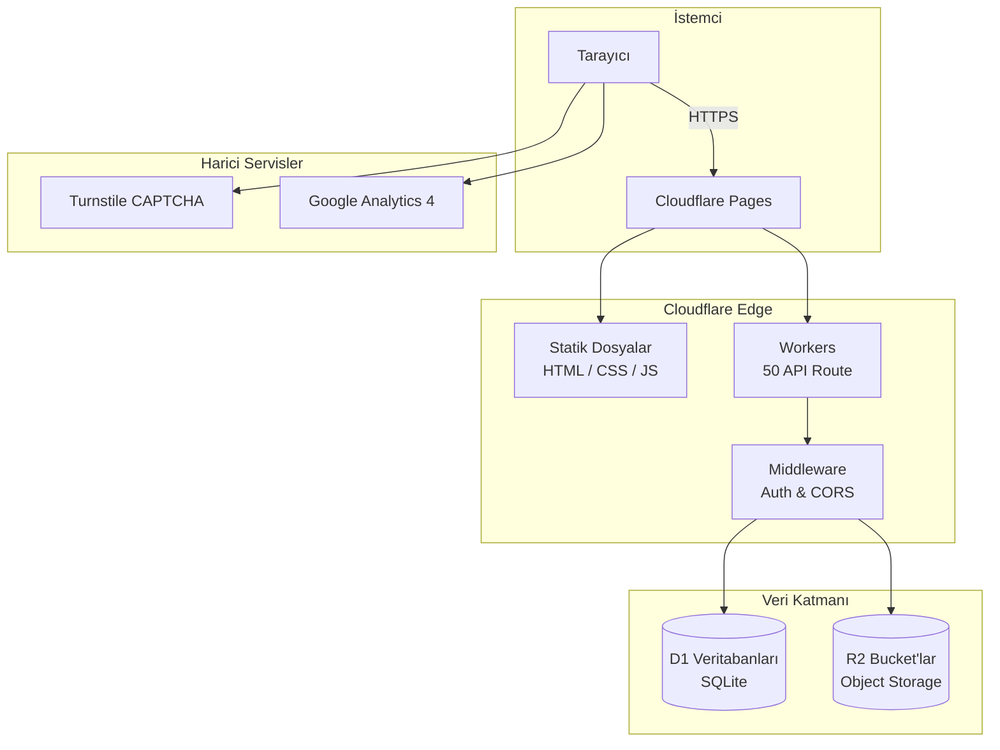

<div align="center">

# AgroAeroTech

**Agricultural Drone Services & UAV Training Platform**

[](https://agroaerotech.com)
[](/)

[](#)
[](#)
[](#)
[](#)
[](#)
[-217346?style=flat-square&logo=microsoftexcel&logoColor=white)](#)
[](#)
[](#)
[](#)
[](#)
[](#)
[](#)
[](#)
[](#)

[English](#english) | [Türkçe](#türkçe)

</div>

---

## English

Full-stack web platform for **AgroAeroTech**, an agricultural drone services and UAV training company based in Azerbaijan.

### Architecture



### Tech Stack

| Layer | Technology |
|:------|:-----------|
| Frontend | `HTML5` `CSS3` `JavaScript` |
| UI | `Bootstrap 5.3` `Font Awesome 6.5` |
| Spreadsheet | `SheetJS (XLSX)` |
| Backend | `Cloudflare Workers` |
| Database | `Cloudflare D1 (SQLite)` |
| Storage | `Cloudflare R2` |
| Hosting | `Cloudflare Pages` |
| Security | `Cloudflare Turnstile` |
| Analytics | `Google Analytics 4` |

### Features

<details>
<summary><b>Public Website</b></summary>

- Responsive, mobile-first design
- Schema.org structured data
- Dynamic blog system with multilingual content
- Certificate verification portal
- Contact, service request, and training application forms
- Drone event services and technical service request pages

</details>

<details>
<summary><b>Admin Dashboard</b></summary>

- Session-based authentication with secure token management and password change
- Blog CMS with multilingual post editor and category management
- Certificate management with PDF/image generation
- Contact and lead management
- Training and certification application review with file management
- Agricultural drone service application management
- Technical service request tracking
- Event services management
- Media upload for content management
- Activity logging and analytics overview
- XLSX export across all modules (contacts, leads, certificates, services, stock) via SheetJS
- Advanced filtering with debounced text search, status dropdowns, date ranges, and category filters

</details>

<details>
<summary><b>Stock Management</b></summary>

Full inventory management system with movement tracking and audit trail.

| Feature | Details |
|:--------|:--------|
| CRUD | Add, edit, delete individual stock items with code, name, quantity, pricing |
| Pricing | Unit price (USD) with auto-calculated sales price including 36% VAT |
| Status Tracking | Automatic status badges: in stock, low stock (below min level), out of stock |
| Stock Movements | Add/remove quantities with descriptions, previous/new quantity logging |
| Movement Revert | Undo any movement with automatic correction records |
| Bulk Upload | Import up to 1000 items from Excel — updates existing or creates new |
| Excel Template | Downloadable XLSX template with example data and column structure |
| Excel Export | Export filtered stock list or movement history as XLSX |
| Filtering | Text search (code/name), status filter (all/in stock/low/out), clear filters |
| History Filtering | Filter movements by stock, movement type (add/remove/initial/correction), date |
| Pagination | Client-side pagination for large datasets |
| Dashboard Stats | Real-time counters for total, in stock, low stock, out of stock items |

**Database:** `STOK_DB` with `stocks`, `stock_movements`, `stock_history` tables — atomic batch transactions for data integrity.

</details>

<details>
<summary><b>API (50 Routes)</b></summary>

**Public Endpoints:** 14 routes

| Method | Endpoint | Description |
|:-------|:---------|:------------|
| `POST` | `/api/contact` | Contact form submission |
| `POST` | `/api/certification-applications` | Certification application with file upload |
| `POST` | `/api/tarimsal-drone-applications` | Agricultural drone service request |
| `POST` | `/api/industrial-solutions` | Industrial solution inquiry |
| `POST` | `/api/technical-service` | Technical service request |
| `POST` | `/api/event-services` | Event service request |
| `POST` | `/api/tarim-basvurulari` | Agricultural application |
| `GET` | `/api/certificate-search` | Certificate verification |
| `GET` | `/api/blogs/list/:lang` | Blog listing by language |
| `GET` | `/api/blogs/:slug/:lang` | Blog post by slug and language |
| `GET` | `/api/blogs-simple` | Simplified blog listing |
| `GET` | `/api/certificate-image/:key` | Certificate image/PDF |
| `POST` | `/api/verify` | Turnstile token verification |
| `POST` | `/api/leads` | Lead capture |

**Admin Endpoints:** 36 routes (protected by auth middleware)

| Category | Routes | Operations |
|:---------|:-------|:-----------|
| Blog Management | 4 | CRUD + multilingual migration + HTML generation |
| Category Management | 2 | CRUD |
| Certificate Management | 3 | CRUD + file download |
| Contact & Lead Management | 3 | List + detail + leads |
| Stock Management | 7 | CRUD + bulk upload + delete all + history + movement revert |
| Training Applications | 3 | List + detail + file access |
| Service Applications | 7 | Agricultural drone, farm, industrial, technical, events |
| Authentication | 4 | Login, logout, session check, password change |
| System | 3 | Activity logs, analytics, image upload |

</details>

<details>
<summary><b>Security</b></summary>

| Layer | Implementation |
|:------|:---------------|
| Transport | HSTS with preload, forced HTTPS |
| Headers | CSP, X-Frame-Options, X-Content-Type-Options, Referrer-Policy |
| Authentication | SHA-256 hashing, constant-time comparison, session tokens |
| Forms | Cloudflare Turnstile CAPTCHA, honeypot fields |
| Input | Regex validation, XSS sanitization, file type/size limits |
| API | Auth middleware, token format validation, server-side invalidation |
| Browser | Permissions Policy restricting camera, microphone, payment APIs |

</details>

<details>
<summary><b>Database Schema</b></summary>

| Database | Purpose | Key Tables |
|:---------|:--------|:-----------|
| `CONTACT_DB` | Contact form submissions | contacts |
| `BLOG_DB` | Blog posts and categories | blogs, categories |
| `CERT_DB` | Certificate management | certificates |
| `CERT_SEARCH_ADD` | Certificate verification portal | cert_search |
| `TARIM_DB` | Agricultural drone applications | applications |
| `TARIM_EGITIM_DB` | Training and certification | certification_applications |
| `STOK_DB` | Stock and inventory | stocks, stock_movements, stock_history |
| `TECHNICAL_SERVICE_DB` | Technical service requests | service_requests |
| `ETKINLIK_DB` | Event services | event_services |
| `DB` | Core app data | users, sessions, activity_logs |

</details>

### Environment Variables

| Variable | Type | Description |
|:---------|:-----|:------------|
| `TURNSTILE_SECRET_KEY` | Secret | Cloudflare Turnstile server-side key |
| `CLOUDFLARE_API_TOKEN` | Secret | Cloudflare API access token |
| `CLOUDFLARE_ZONE_ID` | Secret | Cloudflare zone identifier |
| `CORS_ORIGIN` | Env | Allowed CORS origin |

### Project Structure

```
├── index.html                  # Landing page
├── admin.html                  # Admin dashboard (SPA)
├── admin-login.html            # Admin authentication
├── contact.html                # Contact form
├── blog.html                   # Blog listing
├── about.html                  # About page
├── references.html             # Client references
├── certificate-verification.html
├── education/                  # Training program pages
├── services/                   # Service detail pages
├── legal/                      # GDPR, KVKK, privacy policy
├── functions/                  # Cloudflare Workers backend
│   ├── api/
│   │   ├── admin/              # Protected admin API routes (36)
│   │   └── *.js                # Public API endpoints (14)
│   ├── blog/                   # Dynamic blog rendering
│   ├── blog-multilang/         # Multilingual blog rendering
│   ├── blog-simple/            # Simplified blog rendering
│   ├── contact-detail/         # Contact detail pages
│   ├── _middleware.js           # Global middleware
│   └── _lib/                   # Shared utilities
├── assets/
│   ├── css/                    # Stylesheets
│   ├── js/                     # Client-side scripts
│   ├── img/                    # Images & icons
│   └── videos/                 # Media assets
├── wrangler.toml               # Cloudflare Workers config (D1 & R2 bindings)
├── _headers                    # Security headers config
├── _redirects                  # URL redirects
├── _routes.json                # Routing config
├── .gitattributes              # Git LFS config
├── .gitignore                  # Git ignore rules
├── robots.txt
└── sitemap.xml
```

### Getting Started

```bash
# Install Wrangler CLI
npm install -g wrangler

# Authenticate
wrangler login

# Configure secrets
wrangler secret put TURNSTILE_SECRET_KEY
wrangler secret put CLOUDFLARE_API_TOKEN
wrangler secret put CLOUDFLARE_ZONE_ID

# Run dev server
wrangler pages dev . --d1 DB=<your-db-id>
```

### Deployment

Deploys automatically to **Cloudflare Pages** with Workers for backend logic. Static assets are served from the edge, API routes run as serverless functions.

---

## Türkçe

**AgroAeroTech** için geliştirilmiş full-stack web platformu. Azerbaycan merkezli tarımsal drone hizmetleri ve İHA eğitim şirketi.

### Mimari



### Teknoloji Altyapısı

| Katman | Teknoloji |
|:-------|:-----------|
| Frontend | `HTML5` `CSS3` `JavaScript` |
| UI | `Bootstrap 5.3` `Font Awesome 6.5` |
| Tablo İşleme | `SheetJS (XLSX)` |
| Backend | `Cloudflare Workers` |
| Veritabanı | `Cloudflare D1 (SQLite)` |
| Depolama | `Cloudflare R2` |
| Hosting | `Cloudflare Pages` |
| Güvenlik | `Cloudflare Turnstile` |
| Analitik | `Google Analytics 4` |

### Özellikler

<details>
<summary><b>Genel Site</b></summary>

- Responsive, mobile-first tasarım
- Schema.org yapısal veri
- Çok dilli dinamik blog sistemi
- Sertifika doğrulama portalı
- İletişim, hizmet talebi ve eğitim başvuru formları
- Drone etkinlik hizmetleri ve teknik servis talep sayfaları

</details>

<details>
<summary><b>Admin Paneli</b></summary>

- Güvenli token yönetimi ve şifre değiştirme ile oturum tabanlı kimlik doğrulama
- Çok dilli yazı editörü ve kategori yönetimi ile blog CMS
- PDF/görsel oluşturma ile sertifika yönetimi
- İletişim ve lead yönetimi
- Dosya yönetimi ile eğitim ve sertifikasyon başvuru değerlendirme
- Tarımsal drone hizmet başvuru yönetimi
- Teknik servis talep takibi
- Etkinlik hizmetleri yönetimi
- İçerik yönetimi için medya yükleme
- Aktivite loglama ve analitik genel bakışı
- Tüm modüllerde SheetJS ile XLSX dışa aktarma (iletişim, lead, sertifika, hizmetler, stok)
- Debounced metin arama, durum dropdown'ları, tarih aralıkları ve kategori filtreleri ile gelişmiş filtreleme

</details>

<details>
<summary><b>Stok Yönetimi</b></summary>

Hareket takibi ve denetim izi ile tam envanter yönetim sistemi.

| Özellik | Detay |
|:--------|:------|
| CRUD | Kod, ad, miktar ve fiyatlandırma ile stok ekleme, düzenleme, silme |
| Fiyatlandırma | Birim fiyat (USD) ile %36 EDV dahil otomatik satış fiyatı hesaplama |
| Durum Takibi | Otomatik durum rozetleri: stokta, düşük stok (min seviye altı), stok yok |
| Stok Hareketleri | Açıklama ile miktar ekleme/çıkarma, önceki/yeni miktar kaydı |
| Hareket Geri Alma | Herhangi bir hareketi otomatik düzeltme kaydı ile geri alma |
| Toplu Yükleme | Excel'den 1000'e kadar ürün içe aktarma — mevcut olanı günceller veya yeni oluşturur |
| Excel Şablonu | Örnek veri ve sütun yapısı ile indirilebilir XLSX şablonu |
| Excel Dışa Aktarma | Filtrelenmiş stok listesi veya hareket geçmişini XLSX olarak dışa aktarma |
| Filtreleme | Metin arama (kod/ad), durum filtresi (tümü/stokta/düşük/yok), filtreleri temizle |
| Geçmiş Filtreleme | Hareketleri stok, hareket tipi (ekleme/çıkarma/başlangıç/düzeltme), tarih ile filtreleme |
| Sayfalama | Büyük veri setleri için istemci taraflı sayfalama |
| Dashboard İstatistikleri | Toplam, stokta, düşük stok, stok yok için anlık sayaçlar |

**Veritabanı:** `STOK_DB` — `stocks`, `stock_movements`, `stock_history` tabloları ile atomik batch transaction'lar.

</details>

<details>
<summary><b>API (50 Route)</b></summary>

**Public Endpoint'ler:** 14 route

| Metot | Endpoint | Açıklama |
|:------|:---------|:---------|
| `POST` | `/api/contact` | İletişim formu gönderimi |
| `POST` | `/api/certification-applications` | Dosya yüklemeli sertifikasyon başvurusu |
| `POST` | `/api/tarimsal-drone-applications` | Tarımsal drone hizmet talebi |
| `POST` | `/api/industrial-solutions` | Endüstriyel çözüm talebi |
| `POST` | `/api/technical-service` | Teknik servis talebi |
| `POST` | `/api/event-services` | Etkinlik hizmeti talebi |
| `POST` | `/api/tarim-basvurulari` | Tarımsal başvuru |
| `GET` | `/api/certificate-search` | Sertifika doğrulama |
| `GET` | `/api/blogs/list/:lang` | Dile göre blog listesi |
| `GET` | `/api/blogs/:slug/:lang` | Slug ve dile göre blog yazısı |
| `GET` | `/api/blogs-simple` | Basitleştirilmiş blog listesi |
| `GET` | `/api/certificate-image/:key` | Sertifika görsel/PDF |
| `POST` | `/api/verify` | Turnstile token doğrulama |
| `POST` | `/api/leads` | Lead yakalama |

**Admin Endpoint'ler:** 36 route (auth middleware ile korumalı)

| Kategori | Route | İşlemler |
|:---------|:------|:---------|
| Blog Yönetimi | 4 | CRUD + çok dilli migrasyon + HTML oluşturma |
| Kategori Yönetimi | 2 | CRUD |
| Sertifika Yönetimi | 3 | CRUD + dosya indirme |
| İletişim & Lead Yönetimi | 3 | Listeleme + detay + lead'ler |
| Stok Yönetimi | 7 | CRUD + toplu yükleme + toplu silme + geçmiş + hareket geri alma |
| Eğitim Başvuruları | 3 | Listeleme + detay + dosya erişimi |
| Hizmet Başvuruları | 7 | Tarımsal drone, çiftlik, endüstriyel, teknik, etkinlik |
| Kimlik Doğrulama | 4 | Giriş, çıkış, oturum kontrolü, şifre değiştirme |
| Sistem | 3 | Aktivite logları, analitik, görsel yükleme |

</details>

<details>
<summary><b>Güvenlik</b></summary>

| Katman | Uygulama |
|:-------|:---------|
| Transport | HSTS preload, zorunlu HTTPS |
| Header'lar | CSP, X-Frame-Options, X-Content-Type-Options, Referrer-Policy |
| Kimlik Doğrulama | SHA-256 hashleme, sabit zamanlı karşılaştırma, oturum token'ları |
| Formlar | Cloudflare Turnstile CAPTCHA, honeypot alanları |
| Girdi Doğrulama | Regex validasyon, XSS sanitizasyonu, dosya tür/boyut limitleri |
| API | Auth middleware, token format doğrulama, sunucu taraflı geçersiz kılma |
| Tarayıcı | Permissions Policy ile kamera, mikrofon, ödeme API'leri kısıtlı |

</details>

<details>
<summary><b>Veritabanı Şeması</b></summary>

| Veritabanı | Amaç | Temel Tablolar |
|:-----------|:-----|:---------------|
| `CONTACT_DB` | İletişim formu kayıtları | contacts |
| `BLOG_DB` | Blog yazıları ve kategoriler | blogs, categories |
| `CERT_DB` | Sertifika yönetimi | certificates |
| `CERT_SEARCH_ADD` | Sertifika doğrulama portalı | cert_search |
| `TARIM_DB` | Tarımsal drone başvuruları | applications |
| `TARIM_EGITIM_DB` | Eğitim ve sertifikasyon | certification_applications |
| `STOK_DB` | Stok ve envanter | stocks, stock_movements, stock_history |
| `TECHNICAL_SERVICE_DB` | Teknik servis talepleri | service_requests |
| `ETKINLIK_DB` | Etkinlik hizmetleri | event_services |
| `DB` | Ana uygulama verileri | users, sessions, activity_logs |

</details>

### Ortam Değişkenleri

| Değişken | Tür | Açıklama |
|:---------|:----|:---------|
| `TURNSTILE_SECRET_KEY` | Secret | Cloudflare Turnstile sunucu taraflı anahtar |
| `CLOUDFLARE_API_TOKEN` | Secret | Cloudflare API erişim token'ı |
| `CLOUDFLARE_ZONE_ID` | Secret | Cloudflare zone tanımlayıcısı |
| `CORS_ORIGIN` | Env | İzin verilen CORS origin |

### Proje Yapısı

```
├── index.html                  # Ana sayfa
├── admin.html                  # Admin paneli (SPA)
├── admin-login.html            # Admin giriş
├── contact.html                # İletişim formu
├── blog.html                   # Blog listesi
├── about.html                  # Hakkımızda
├── references.html             # Referanslar
├── certificate-verification.html
├── education/                  # Eğitim programları
├── services/                   # Hizmet detay sayfaları
├── legal/                      # GDPR, KVKK, gizlilik politikası
├── functions/                  # Cloudflare Workers backend
│   ├── api/
│   │   ├── admin/              # Korumalı admin API route'ları (36)
│   │   └── *.js                # Public API endpoint'ler (14)
│   ├── blog/                   # Dinamik blog render
│   ├── blog-multilang/         # Çok dilli blog render
│   ├── blog-simple/            # Basitleştirilmiş blog render
│   ├── contact-detail/         # İletişim detay sayfaları
│   ├── _middleware.js           # Global middleware
│   └── _lib/                   # Paylaşılan yardımcı fonksiyonlar
├── assets/
│   ├── css/                    # Stil dosyaları
│   ├── js/                     # İstemci taraflı script'ler
│   ├── img/                    # Görseller ve ikonlar
│   └── videos/                 # Medya dosyaları
├── wrangler.toml               # Cloudflare Workers yapılandırması (D1 & R2 bağlamaları)
├── _headers                    # Güvenlik başlıkları
├── _redirects                  # URL yönlendirmeleri
├── _routes.json                # Routing yapılandırması
├── .gitattributes              # Git LFS yapılandırması
├── .gitignore                  # Git ignore kuralları
├── robots.txt
└── sitemap.xml
```

### Kurulum

```bash
# Wrangler CLI kurulumu
npm install -g wrangler

# Kimlik doğrulama
wrangler login

# Secret tanımlama
wrangler secret put TURNSTILE_SECRET_KEY
wrangler secret put CLOUDFLARE_API_TOKEN
wrangler secret put CLOUDFLARE_ZONE_ID

# Dev server başlatma
wrangler pages dev . --d1 DB=<your-db-id>
```

### Dağıtım

Proje, backend için Workers ile birlikte **Cloudflare Pages** üzerine otomatik deploy edilir. Statik dosyalar edge'den sunulur, API route'ları serverless fonksiyonlar olarak çalışır.

---

<div align="center">

**All rights reserved.**

</div>
